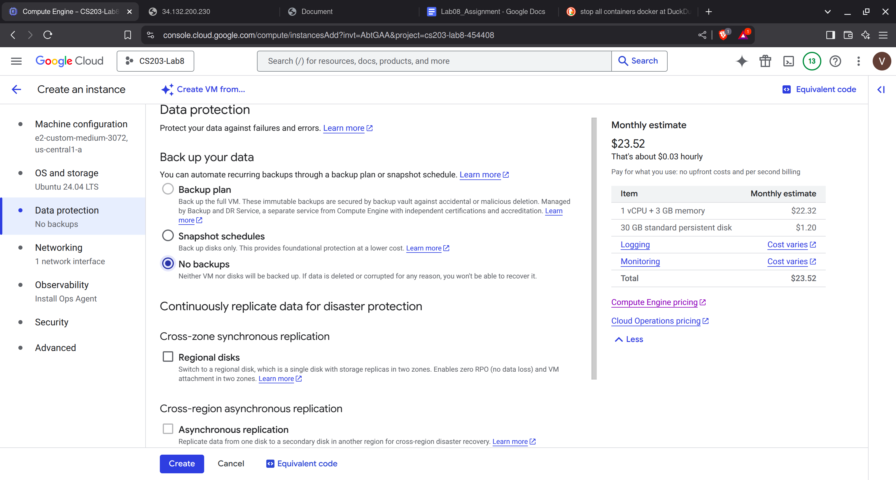
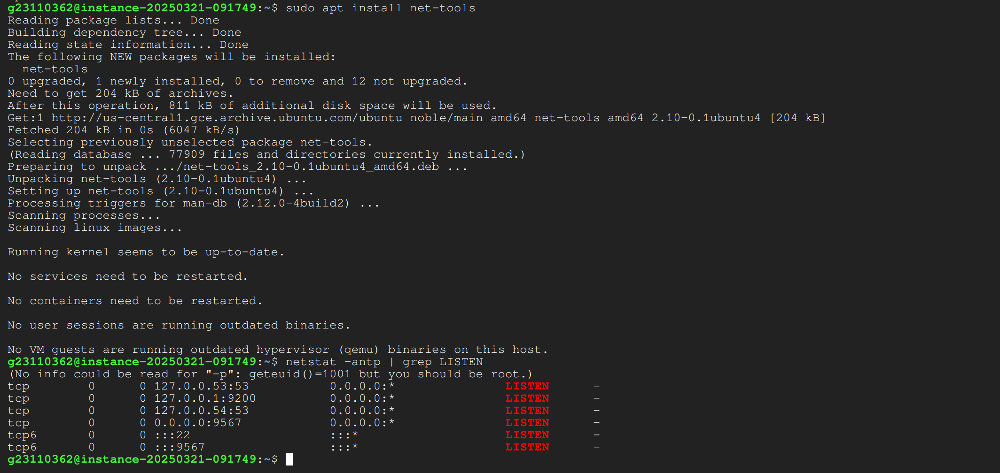
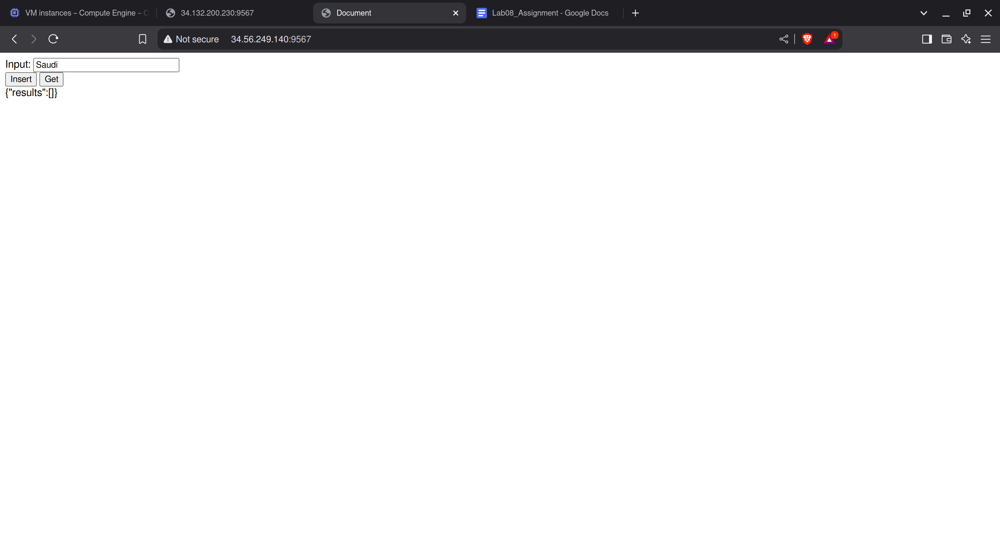

# CS203 Lab 8

## Team Number: 33
## Team Members

### Member 1
- Name: Vivek Raj
- Roll No: 23110362
- Github: VivekRaj2708

### Member 2
- Name: Sharvari Mirge
- Roll No: 23110298
- Github: msharvari31

# Files

## Docker Images

- FastAPI (Client): https://hub.docker.com/repository/docker/vivekraj196/fastapi0/general

- FastAPI (Server): https://hub.docker.com/repository/docker/vivekraj196/fastapi1/general

- ElasticSeacrh: https://hub.docker.com/layers/library/elasticsearch/8.17.3/images/sha256-934ea65eb8967b72086b2449b46f5bd4d63475a02e7ec6f246f6e054d3136137

## Docker Files

- FastAPI0: https://github.com/VivekRaj2708/CS203_Lab8/blob/main/Frontent/dockerfile

- FastAPI1: https://github.com/VivekRaj2708/CS203_Lab8/blob/main/Backend/dockerfile

## Special Notes

**Note**: DockerFile has been uploaded to GITHUB

**Note**:  Docker Images are Non Reproducable (NON STATIC IP)

<div style="page-break-after: always;"></div>


# VM Creation

1. Go to VM Dashboard and Click on Create Instance Button


2. Select `us-central1 (Iowa)` as Region and `us-central1-a` as Zone
3. Select E2 System


<div style="page-break-after: always;"></div>


4. Go to custom VM Settings and set `1` vCPU Code and `3GB` of RAM


5. Under OS and Disk. Select Ubuntu 24.04 LTS (Latest) and For Statndard Disk  give `30GB` of space for the VM


<div style="page-break-after: always;"></div>


6. Remove Backups



7. Under Firewall Settings, enable `HTTP` and `HTTPS` Traffic


<div style="page-break-after: always;"></div>


8. Turn OFF Ops Agent 


9. Change the VM Type to SPOT 


10. And Click `Create` Button to create your virtual machine


11. Firewall Settings

```sh
gcloud compute --project=cs203-lab8-454408 firewall-rules create allow-p9567 --direction=INGRESS --priority=1 --network=default --action=ALLOW --rules=tcp:9567 --source-ranges=0.0.0.0/0
```


# Frontend

This api sets up a simple FastAPI web application that serves an HTML page using Jinja2 templates.

## Requirements
Ensure you have FastAPI installed:

```bash
pip install "fastapi[standard]"
```

## Project Structure
```
project_folder/
│-- main.py
│-- templates/
│   ├── Home.html
```

## FastAPI Code

```python
from fastapi import FastAPI, Request
from fastapi.templating import Jinja2Templates
from fastapi.responses import HTMLResponse

templates = Jinja2Templates(directory="Template")

app = FastAPI()
@app.get("/", response_class=HTMLResponse)
async def home(request: Request):
    return templates.TemplateResponse(name="Home.html", context={"request": request})
```

<div style="page-break-after: always;"></div>


# Frontend Docker Image

## Dockerfile

```dockerfile
FROM python:3.13-slim

WORKDIR /api

RUN pip install --no-cache-dir "fastapi[standard]" elasticsearch

COPY . .

CMD ["sh",  "-c", "fastapi run client.py --port 9567"]
```

## Build and Push Image

```bash
docker build -t frontent .
docker tag frontent:latest vivekraj196/fastapi0:latest
docker push frontent:latest vivekraj196/fastapi0:latest
```

### Output


## Downloading and Running Image

```bash
docker pull vekraj196/fastapi0:latest
docker run -it -p 9567:9567 vivekraj196/fastapi0
```


## Output


<div style="page-break-after: always;"></div>


# ElasticSearch

## Creating Internatl Netwrok

```bash
docker network create -d bridge elastic-net
```

## Downloading and Runing ElasticSearch

```bash
docker pull docker.elastic.co/elasticsearch/elasticsearch:8.17.3
docker run -p 127.0.0.1:9200:9200 -d --name elasticsearch   -e "discovery.type=single-node"   -e "xpack.security.enabled=false"   -e "xpack.license.self_generated.type=trial"   -v "elasticsearch-data:/usr/share/elasticsearch/data" --network=elastic-net docker.elastic.co/elasticsearch/elasticsearch:8.17.3
```

### Settings

1. **Persistant Volume**: `elasticsearch-data`
2. **Network**: `elastic-net`

## Initialise `india` Document

```bash
curl -X PUT "http://localhost:9200/india" -H "Content-Type: application/json" -d '{
  "mappings": {
    "properties": {
      "id": { "type": "keyword" },
      "text": { "type": "text" }
    }
  }
}'
```

<div style="page-break-after: always;"></div>


## Update the `india` Document

Insert the first four paragraphss into the elastic search volume:

```bash
curl -X POST "http://localhost:9200/india/_bulk" -H "Content-Type: application/json" --data-binary @- <<EOF
{ "index": { "_id": "1" } }
{ "id": "1", "text": "India, officially the Republic of India, is a country in South Asia. It is the seventh-largest country by area; the most populous country from June 2023 onwards; and since its independence in 1947, the world's most populous democracy. Bounded by the Indian Ocean on the south, the Arabian Sea on the southwest, and the Bay of Bengal on the southeast, it shares land borders with Pakistan to the west; China, Nepal, and Bhutan to the north; and Bangladesh and Myanmar to the east. In the Indian Ocean, India is near Sri Lanka and the Maldives; its Andaman and Nicobar Islands share a maritime border with Thailand, Myanmar, and Indonesia." }

{ "index": { "_id": "2" } }
{ "id": "2", "text": "Modern humans arrived on the Indian subcontinent from Africa no later than 55,000 years ago. Their long occupation, predominantly in isolation as hunter-gatherers, has made the region highly diverse, second only to Africa in human genetic diversity. Settled life emerged on the subcontinent in the western margins of the Indus river basin 9,000 years ago, evolving gradually into the Indus Valley Civilisation of the third millennium BCE. By 1200 BCE, an archaic form of Sanskrit, an Indo-European language, had diffused into India from the northwest. Its hymns recorded the dawning of Hinduism in India. India's pre-existing Dravidian languages were supplanted in the northern regions. By 400 BCE, caste had emerged within Hinduism, and Buddhism and Jainism had arisen, proclaiming social orders unlinked to heredity. Early political consolidations gave rise to the loose-knit Maurya and Gupta Empires. Widespread creativity suffused this era, but the status of women declined, and untouchability became an organized belief. In South India, the Middle kingdoms exported Dravidian language scripts and religious cultures to the kingdoms of Southeast Asia." }

{ "index": { "_id": "3" } }
{ "id": "3", "text": "In the early medieval era, Christianity, Islam, Judaism, and Zoroastrianism became established on India's southern and western coasts. Muslim armies from Central Asia intermittently overran India's northern plains. The resulting Delhi Sultanate drew northern India into the cosmopolitan networks of medieval Islam. In south India, the Vijayanagara Empire created a long-lasting composite Hindu culture. In the Punjab, Sikhism emerged, rejecting institutionalized religion. The Mughal Empire, in 1526, ushered in two centuries of relative peace, leaving a legacy of luminous architecture. Gradually expanding rule of the British East India Company turned India into a colonial economy but consolidated its sovereignty. British Crown rule began in 1858. The rights promised to Indians were granted slowly, but technological changes were introduced, and modern ideas of education and public life took root. A pioneering and influential nationalist movement, noted for nonviolent resistance, became the major factor in ending British rule. In 1947, the British Indian Empire was partitioned into two independent dominions, a Hindu-majority dominion of India and a Muslim-majority dominion of Pakistan. A large-scale loss of life and an unprecedented migration accompanied the partition." }

{ "index": { "_id": "4" } }
{ "id": "4", "text": "India has been a federal republic since 1950, governed through a democratic parliamentary system. It is a pluralistic, multilingual and multi-ethnic society. India's population grew from 361 million in 1951 to over 1.4 billion in 2023. During this time, its nominal per capita income increased from US$64 annually to US$2,601, and its literacy rate from 16.6% to 74%. A comparatively destitute country in 1951, India has become a fast-growing major economy and hub for information technology services; it has an expanding middle class. Indian movies and music increasingly influence global culture. India has reduced its poverty rate, though at the cost of increasing economic inequality. It is a nuclear-weapon state that ranks high in military expenditure. It has disputes over Kashmir with its neighbors, Pakistan and China, unresolved since the mid-20th century. Among the socio-economic challenges India faces are gender inequality, child malnutrition, and rising levels of air pollution. India's land is megadiverse with four biodiversity hotspots. India's wildlife, which has traditionally been viewed with tolerance in its culture, is supported in protected habitats." }
EOF

```

### Verify Inserted Data

```bash
curl -X GET "http://localhost:9200/india/_search?pretty" -H "Content-Type: application/json" -d '{
  "query": {
    "match_all": {}
  }
}'
```

<div style="page-break-after: always;"></div>


### Output


<div style="page-break-after: always;"></div>


# Backend


## Initialize Elasticsearch Index
**Endpoint:** `GET /__init`  
- Creates the `india` index if it doesn’t exist  
- Inserts initial documents  

## Insert a Document
**Endpoint:** `GET /isrt/{doc}`  
- Inserts a new document with a unique `id`.  
- Example:  
  ```sh
  curl -X GET "http://localhost:8000/isrt/Hello%20World"
  ```

## Search Documents
**Endpoint:** `GET /search/{query}`  
- Performs a **match** search on `text`.  
- Example:  
  ```sh
  curl -X GET "http://localhost:8000/search/India"
  ```

## Health Check
**Endpoint:** `GET /health`  
- Returns `{"status": "ok"}` if the service is running.

<div style="page-break-after: always;"></div>


## Python Code

```python
from fastapi import FastAPI, HTTPException
from elasticsearch import Elasticsearch
import os

app = FastAPI()

ELASTICSEARCH_HOST = os.getenv("ELASTICSEARCH_HOST", "http://host.docker.internal:9200")
es = Elasticsearch([ELASTICSEARCH_HOST])
INDEX_NAME = "india"

def create_index():
    if not es.indices.exists(index=INDEX_NAME):
        es.indices.create(index=INDEX_NAME, body={
            "mappings": {
                "properties": {
                    "id": {"type": "keyword"},
                    "text": {"type": "text"}
                }
            }
        })
create_index()

@app.get("/insert/{query}")
def insert_document(query: str):
    doc_id = str(hash(query))  # Generate unique ID
    doc = {"id": doc_id, "text": query}
    res = es.index(index=INDEX_NAME, id=doc_id, document=doc)
    return {"result": res["result"], "id": doc_id}

@app.get("/get/{query}")
def get_document(query: str):
    res = es.search(index=INDEX_NAME, body={
        "query": {"match": {"text": query}}
    })
    return {"hits": res["hits"]["hits"]}
```

<div style="page-break-after: always;"></div>


## DockerFile

```dockerfile
FROM python:3.13-slim

WORKDIR /api
RUN pip install --no-cache-dir "fastapi[standard]" elasticsearch
COPY . .
ENV ELASTICSEARCH_HOST=http://elasticsearch:9200
CMD ["sh",  "-c", "fastapi run backend/server.py --port 9567"]
```

## Build and Push

```bash
docker build -t backend .
docker tag backend:latest vivekraj196/fastapi1:latest
docker push vivekraj196/fastapi1:latest
```

## Download and Run

```bash
docker pull vivekraj196/fastapi1:latest
docker run -it -p 9567:9567 --network=elastic-net --add-host=host.docker.internal:host-gateway vivekraj196/fastapi1:latest
```

### Output


<div style="page-break-after: always;"></div>


# Docker Outputs

## VM - 1

### Running Continers

```bash
docker ps -a
```


### Net Stat

```bash
sudo apt install net-tools
netstat -antp | grep LISTEN
```


<div style="page-break-after: always;"></div>


### Installed Docker Images

```bash
docker images
```


<div style="page-break-after: always;"></div>


## VM - 2

### Net Stat

```bash
sudo apt install net-tools
netstat -antp | grep LISTEN
```



### Installed Docker Images

```bash
docker images
```


<div style="page-break-after: always;"></div>


# Software Outputs

## SEARCH Request

1. Trail 1 (`India`)


2. Trail 2 (`Saudi`)



<div style="page-break-after: always;"></div>


3. Trail 3 (`largest`)


<div style="page-break-after: always;"></div>


## INSERT Request

1. Inserting the Document (`HelloNodeJS`)


2. Finding Inserted Document


<div style="page-break-after: always;"></div>


3. Stopping all containers

```bash
docker stop $(docker ps -a -q)
docker rm $(docker ps -a -q)
```


<div style="page-break-after: always;"></div>

4. Restart Container and Test Again


<div style="page-break-after: always;"></div>

# Docker Inspect

## Elastic Search


## Backend


<div style="page-break-after: always;"></div>


## Frontend


